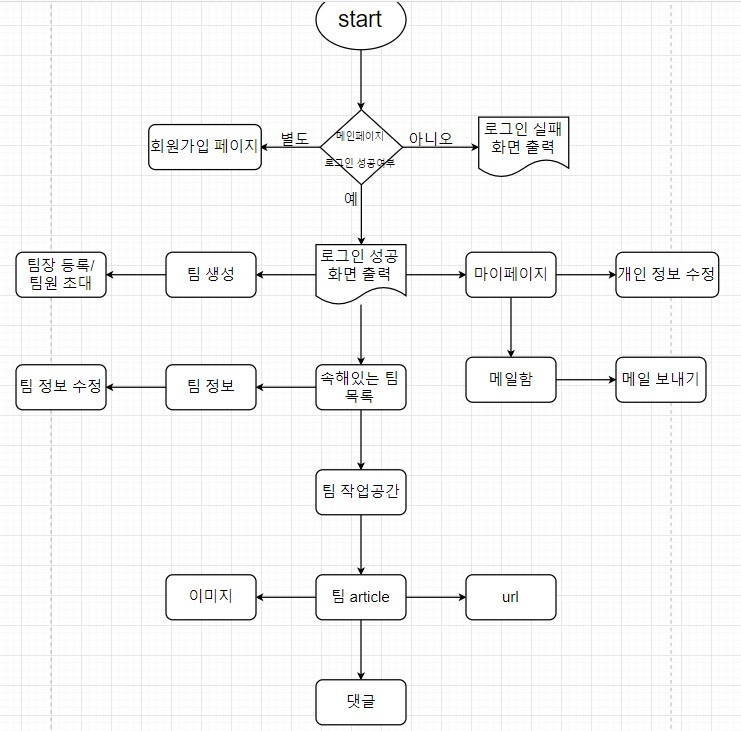

# TeamPle

U임승차(팀플에서 필요한 기능들을 한번에 모은 웹서비스)

## 프로젝트 기본 설정

```bash
python3 -m venv venv
source venv/bin/activate
pip3 install -r requirements.txt
```

가상환경 생성후 활성화하고 requirements.txt에 있는 필요한 패키지들 설치(리눅스 기준)

## 설계




## 개발 체크리스트

### 태현

- [x] 팀 생성, 초대 기능(team 앱)
- [x] 팀 글, 댓글 구현
- [x] 파일, 이미지 여러개 추가하는 방식 구현

### 남은 것들

- [ ] 전체적인 프론트엔드
- [ ] 백엔드와 프론트엔드 병합

### 고려할 것들

- 백엔드 view 함수들 기능 정상적으로 되는지 확인
- 부트스트랩 테마를 쓰는 것
- 필요한 기능들 있는지 확인하기

## 팁

- 마이그레이션 오류

```bash
find . -path "*/migrations/*.py" -not -name "__init__.py" -delete
find . -path "*/migrations/*.pyc"  -delete
python manage.py makemigrations
python manage.py migrate
```

마이그레이션 파일들(__init__.py 제외)을 삭제하고 다시 마이그레이션한다.

- manage.py 관련 오류

```bash
pip3 uninstall django
pip3 install django==2.2.3
```
